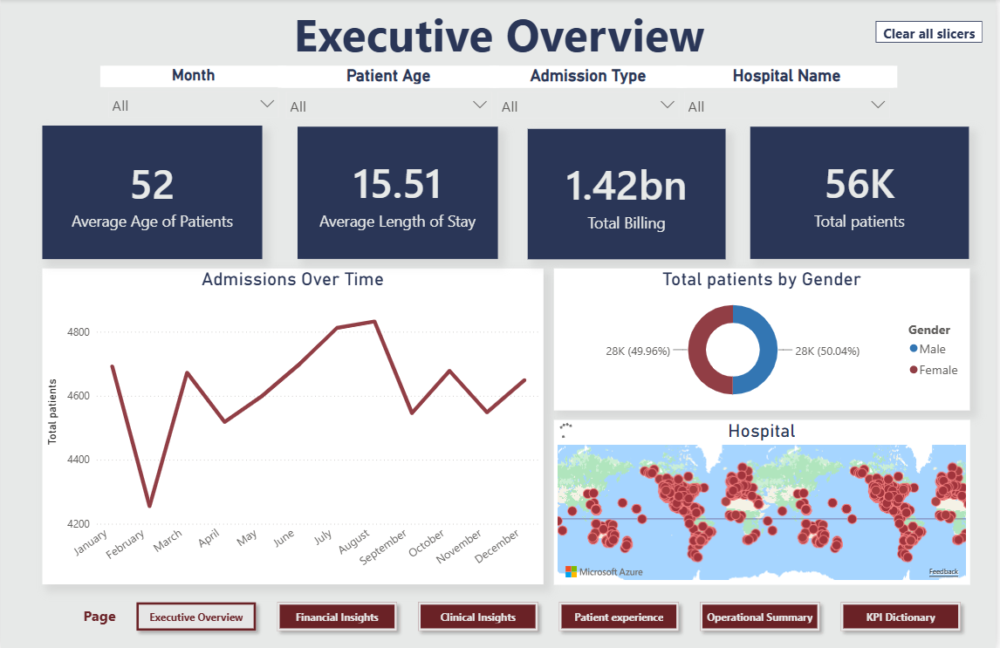
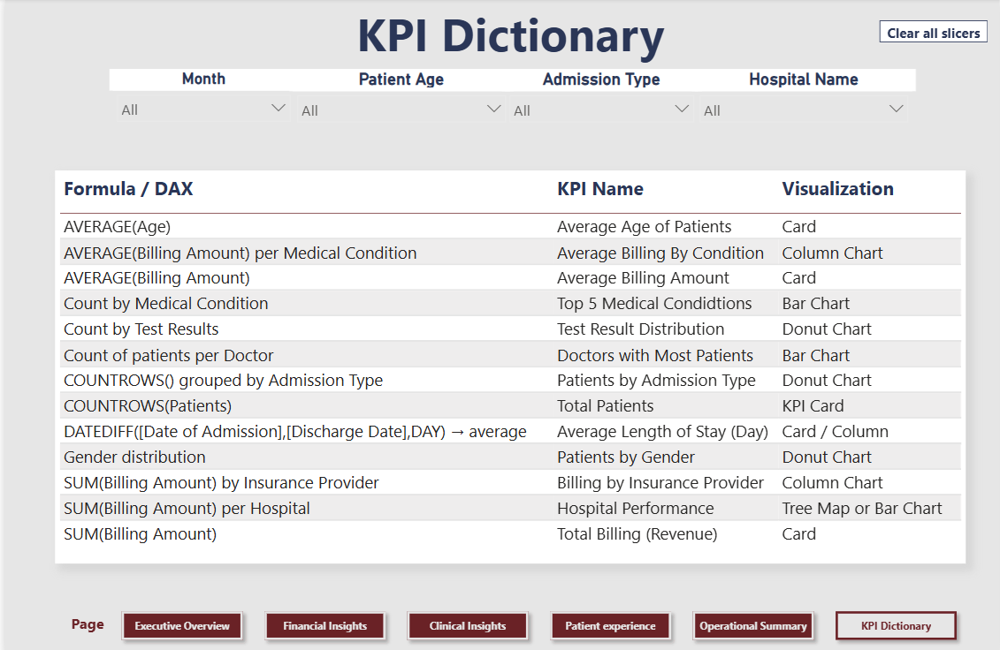

# Healthcare Analytics Dashboard

A 6-page Power BI dashboard analyzing hospital data across financial, clinical, and operational dimensions, built as a team project (4 members) for BCIS 421.

## My Contribution & Key Findings

## 1. Executive Overview
Built the landing page summarizing overall hospital performance.

- Total of 56K patients across all hospitals, nearly split evenly by gender (49.96% male / 50.04% female)
- Average patient age is 52, with an average length of stay of 15.51 days
- Total billing reached 1.42bn, with admissions fluctuating between 4,200–4,900 patients monthly, dipping notably in February
- Patient distribution mapped geographically across hospital locations

## 2. Financial Insights
Built the revenue and cost breakdown page.

- Billing is fairly evenly distributed across the top 5 insurance providers (Cigna, Medicare, Blue Cross, UnitedHealthcare, Aetna), each around 0.28–0.29bn — no single provider dominates
- Johnson PLC is the top-billing hospital at 1.08M, with billing across the top 10 hospitals ranging narrowly between 0.81M–1.08M
- Identified top-billing doctors individually, led by Michael Smith (784.50K) and Robert Smith (634.79K)
- Total billing by year shows a rise-then-decline pattern, useful for spotting revenue trends over time

## 3. KPI Dictionary
Built the reference page documenting the dashboard's full measure library.

- Catalogued 15 KPIs with their exact DAX formulas (e.g. AVERAGE, SUM, COUNTROWS, DATEDIFF) and matching visualization type
- Ensures the dashboard is auditable and reproducible by any analyst reviewing the logic behind each metric

## Overall Project Insights
Combining findings across all 6 pages, the dashboard tells a consistent story about hospital operations:

- **Financially**, revenue is stable and well-diversified — no single insurance provider or hospital dominates billing, which reduces dependency risk across the network
- **Demographically**, the patient base is balanced by gender with an average age of 52, suggesting the hospital network serves a broad, general population rather than a specialized age group
- **Operationally**, admissions show seasonal fluctuation (notably dropping in February), which could inform staffing and resource planning
- **Clinically**, the dashboard tracks top medical conditions and test outcomes, helping identify which conditions drive the highest patient volume and cost
- Together, the 6 pages move from a high-level executive summary down to granular, auditable KPI definitions — giving both leadership and analysts the right level of detail for their needs

## Dashboard Pages
1. Executive Overview
2. Financial Insights
3. Clinical Insights
4. Patient Experience
5. Operational Summary
6. KPI Dictionary

## Tools
Power BI · DAX · Power Query
